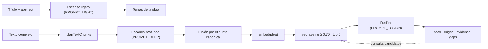

# Cadena de extracción con LLM

Describe las nueve llamadas a modelo que median entre un documento fuente y el grafo
de conocimiento: dónde se sitúa cada una, qué recibe y qué escribe. No es una decisión
de arquitectura; documenta la cadena tal como está implementada en `electron/ai`.

## Reparto

Tres llamadas construyen el grafo; seis lo leen. Solo el escaneo profundo produce
ideas y evidencia: cualquier otra superficie trabaja sobre material ya extraído.

El grafo es destino y entrada a la vez: cada idea extraída se compara con las ideas ya
almacenadas antes de convertirse en nodo. Con el conjunto de candidatos vacío no hay
llamada de fusión.

## Trayecto de ingesta

| Paso | Módulo | Parámetros |
|---|---|---|
| Escaneo ligero | `ai/lightScan.ts` | solo título, abstract y metadatos; 1–3 temas amplios |
| Fragmentación | `extraction/textExtractor.ts` | 1.800 palabras con 100 de solape; modo largo 30.000 con ~600 |
| Escaneo profundo | `ai/deepScan.ts` | una llamada por fragmento; límites por fragmento en `analysis_limits` |
| Fusión por etiqueta | `ai/deepScan.ts` | une ideas con la misma etiqueta canónica dentro de la obra |
| Embeddings | `ai/embeddingPipeline.ts` | blob Float32 en la propia tabla `ideas` |
| Recuperación | `db/vectorScan.ts` | `vec_cosine` ≥ 0,70, máximo 6 candidatos; sin índice vectorial |
| Fusión | `ai/fusion.ts` | `same_as` / `variant_of` / `new`, con edge opcional |

El modo largo escala el presupuesto de ideas por fragmento a `chunkWords / 4000`,
acotado entre 6 y 16. Sin embedding disponible, la recuperación cae a solape léxico
con umbral 0,18.

Los resultados del escaneo profundo se registran por fragmento en `scan_checkpoints`,
de modo que un fallo reanuda en lugar de reiniciar.

## Reglas transversales de los prompts

Todos los prompts comparten tres restricciones, y conviene preservarlas al editarlos:

- ninguna idea, relación o cita puede existir sin un pasaje real del texto;
- la evidencia es verbatim en el idioma original, máximo ~30 palabras, sin páginas inventadas;
- ante la duda se baja la confianza o se omite, en lugar de completar.

`PROMPT_FUSION` añade una regla que no debe perderse en refactorizaciones: una
contradicción nunca colapsa en `same_as`; se convierte en `variant_of` o `new` con un
edge `contradicts`.

## Composición en el límite de llamada

Ningún prompt llega al modelo tal como está en el fuente. `aiClient` compone dos
directivas sobre el mensaje de sistema, en orden fijo:

1. `withVaultTypeContext` añade el pack de persona del tipo de vault activo; vacío para
   vaults académicos, por lo que no altera una biblioteca de investigación normal;
2. `withPromptLanguage` añade la directiva de idioma de salida, solo cuando
   `promptLanguage` no es español.

La segunda va al final de forma deliberada: los prompts están escritos en español y
piden salida en español de forma repetida, y la directiva cancela explícitamente esas
instrucciones previas. La única excepción son los campos `quote`, que se copian
verbatim en el idioma de la fuente y nunca se traducen.

Consecuencia práctica: para obtener salida en otro idioma basta cambiar el ajuste, sin
tocar los prompts. Traducir los cuerpos solo es necesario si se quiere que las propias
instrucciones sean legibles en ese idioma.

## Referencia de llamadas

| Prompt | Módulo | Función | Temp | Máx. tokens |
|---|---|---|---|---|
| `PROMPT_LIGHT` | `ai/lightScan.ts` | abstract → temas amplios | 0,15 | 1.500 |
| `PROMPT_DEEP` | `ai/deepScan.ts` | fragmento → ideas, evidencia, relaciones, huecos | 0,15 | — |
| `PROMPT_FUSION` | `ai/fusion.ts` | idea nueva frente al grafo | 0,1 | 800 |
| `PROMPT_SUMMARY` | `ai/summaryScan.ts` | material extraído → prosa de orientación | 0,2 | 800 |
| `PROMPT_DEBATE` | `ai/debate.ts` | edge de contradicción → análisis del debate | 0,3 | 1.400 |
| `PROMPT_RQ_DECOMPOSE` | `ai/researchMap.ts` | pregunta → sub-preguntas | 0,2 | 1.600 |
| `PROMPT_RQ_COVERAGE` | `ai/researchMap.ts` | sub-pregunta → veredicto de cobertura | — | — |
| `VALIDATION_SYSTEM` | `ai/semanticBridges.ts` | pares similares sin edge → relaciones | 0,1 | — |
| `RELATION_SYSTEM` | `ai/reprocessConnections.ts` | revalidación por lotes de relaciones | 0,1 | 4.000 |

Las casillas vacías indican que la llamada no fija ese parámetro y hereda el valor por
defecto del cliente.

Los siete primeros viven en `electron/ai/prompts.ts`. `VALIDATION_SYSTEM` y
`RELATION_SYSTEM` están declarados en línea en sus módulos y son casi idénticos entre
sí: mismo vocabulario de tipos y mismas bandas de confianza, con distinto tamaño de
lote. Al ajustar la taxonomía de relaciones hay que tocar los dos, o divergen en
silencio.

## Mapa de temas de investigación

`researchMap` es la única superficie con dos prompts encadenados: descompone una
pregunta en 4–8 sub-preguntas y, para cada una, recupera candidatos por similitud y
emite un veredicto `covered` / `partial` / `disputed` / `uncovered`.

El conjunto de candidatos es cerrado y el veredicto solo puede citar ids que la
recuperación haya devuelto. Por eso `uncovered` describe un hueco de la biblioteca y no
un hueco del modelo.
